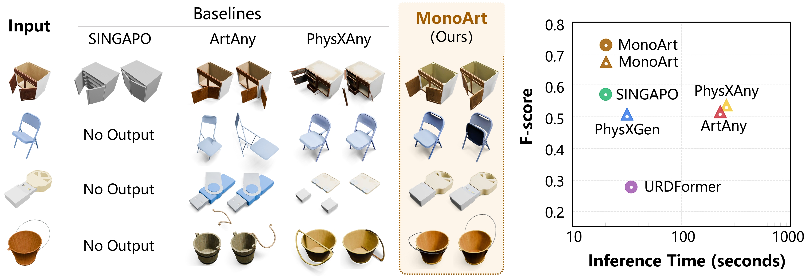

# MonoArt: Progressive Structural Reasoning for Monocular Articulated 3D Reconstruction

[Haitian Li](https://quest4science.github.io/)\*, [Haozhe Xie](https://haozhexie.com)\*, [Junxiang Xu](https://linkedin.com/in/junxiang-xu-324812328), [Beichen Wen](https://github.com/wenbc21), [Fangzhou Hong](https://hongfz16.github.io/), [Ziwei Liu](https://liuziwei7.github.io/)

S-Lab, Nanyang Technological University




## Changelog🔥

- [2026/03/17] Repository created.

## Cite this work📝

```
@article{li2026monoart,
  title     = {{MonoArt:} Progressive Structural Reasoning for Monocular Articulated 3D Reconstruction},
  author    = {Li, Haitian and
               Xie, Haozhe and
               Xu, Junxiang and
               Wen, Beichen and
               Hong, Fangzhou and
               Liu, Ziwei},
  journal   = {arXiv preprint arXiv 2603.19231},
  year      = {2026}
}
```
