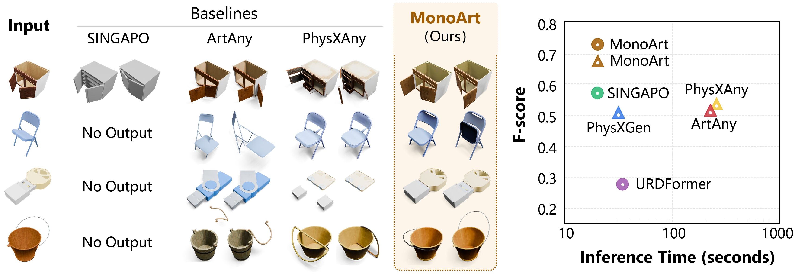

<h1 align="center">MonoArt</h1>

<p align="center">
  <a href="README.md">English</a> | <strong>简体中文</strong>
</p>

<h3 align="center">基于渐进式结构推理的单目关节三维重建</h3>

<p align="center"><strong>🎉 已被 ECCV 2026 接收</strong></p>

<p align="center">
  <a href="https://quest4science.github.io/">Haitian Li</a><sup>*</sup> ·
  <a href="https://haozhexie.com">Haozhe Xie</a><sup>*</sup> ·
  <a href="https://linkedin.com/in/junxiang-xu-324812328">Junxiang Xu</a> ·
  <a href="https://github.com/wenbc21">Beichen Wen</a> ·
  <a href="https://hongfz16.github.io/">Fangzhou Hong</a> ·
  <a href="https://liuziwei7.github.io/">Ziwei Liu</a><sup>†</sup>
</p>

<p align="center">
  南洋理工大学 S-Lab<br>
  <sup>*</sup> 共同一作 &nbsp;&nbsp; <sup>†</sup> 通讯作者
</p>

<p align="center">
  <a href="https://eccv.ecva.net/Conferences/2026">
    
  </a>
  <a href="https://arxiv.org/abs/2603.19231">
    
  </a>
  <a href="https://lihaitian.com/MonoArt">
    
  </a>
  <a href="https://github.com/Quest4Science/MonoArt/releases">
    
  </a>
</p>

<p align="center">
  
</p>

<p align="center"><em>从单张图像恢复带纹理、分部件且可运动的关节三维资产。</em></p>

## 🔥 新闻

- **ECCV 2026：** MonoArt 已被欧洲计算机视觉会议接收！🎉
- **更新的工作：** [PhysX-Omni](https://arxiv.org/abs/2605.21572) 取得了更强的效果，并将可用于
  仿真的物理三维生成扩展到统一框架，同时覆盖刚体、可变形物体和关节物体。
  [[项目主页](https://physx-omni.github.io/)]

## ✨ 项目简介

本仓库是论文 **MonoArt: Progressive Structural Reasoning for Monocular Articulated 3D
Reconstruction** 的官方实现。MonoArt 能够从单张物体图像恢复带纹理、分部件且可运动的关节三维资产。

## 📌 发布状态

整理得到的 `monoart_stage1.pt` 权重合并了 MonoArt 自有的语义推理器和运动解码器权重，并移除了优化器状态。TRELLIS 仍使用独立的外部权重。当前发布的权重**不包含** Kinematic Estimator head，因此 Stage-1 推理会将预测出的各个 link 连接到 base。仓库已经包含该估计器的网络结构和 Stage-2 训练流程，但要生成完整的运动学树，仍需使用包含 `parent_head_state_dict` 的权重。

你可以通过 `monoart inspect-checkpoint` 查看这一权重边界；如果保留了中间文件，也可以在 `work/run.json` 中查看。

## 🗓️ 待办事项

- [x] ~~发布经过初步整理且功能可用、但尚未完全完善的代码和模型权重。~~
- [ ] **2026 年 10 月：** 修复剩余的小问题并发布最终版本。

## 🛠️ 安装

MonoArt 的所有阶段共用一个 Conda 环境。TRELLIS 仍通过子进程运行，使其 GPU 资源能够在语义推理和运动预测阶段开始前被释放。

```bash
conda env create -f environment/monoart.yml
conda activate monoart
bash scripts/install_dependencies.sh
```

下面的示例统一使用 `python -m monoart`，以明确指定当前使用的 Python 解释器。安装后也可以使用更短的 `monoart ...`：它是安装在当前 Conda 环境中的 Python 命令行入口，并不是 shell 别名。安装与运行均不需要 `sudo`，也不会修改仓库文件权限。`PYTHONNOUSERSITE=1` 仅用于防止用户全局 Python 目录中的包混入当前环境。

更多安装细节和故障排查方法见 [docs/installation.md](docs/installation.md)。

## 📦 模型权重

将发布的模型权重及其 manifest 下载到 `checkpoints/`：

```bash
curl -L -o checkpoints/monoart_stage1.pt \
  https://github.com/Quest4Science/MonoArt/releases/latest/download/monoart_stage1.pt
curl -L -o checkpoints/monoart_stage1.pt.json \
  https://github.com/Quest4Science/MonoArt/releases/latest/download/monoart_stage1.pt.json
python -m monoart verify-checkpoint checkpoints/monoart_stage1.pt
python -m monoart inspect-checkpoint checkpoints/monoart_stage1.pt
```

### TRELLIS 权重

`third_party/TRELLIS/` 是安装脚本创建的 TRELLIS 源码目录，并不是模型权重目录。首次运行推理时，MonoArt 会自动从 Hugging Face 下载 [`JeffreyXiang/TRELLIS-image-large`](https://huggingface.co/JeffreyXiang/TRELLIS-image-large)，并默认保存到标准缓存目录 `~/.cache/huggingface/hub/`。如需使用其他缓存位置，请在运行 MonoArt 前设置 `HF_HOME=/path/to/huggingface-cache`。如果缓存中尚无该模型，首次运行需要联网。

## 🚀 推理

在统一的 `monoart` 环境中运行完整流程：

```bash
PYTHONNOUSERSITE=1 python -m monoart run path/to/object.png \
  --checkpoint checkpoints/monoart_stage1.pt \
  --output outputs/demo \
  --trellis-root third_party/TRELLIS
```

默认输出为紧凑的关节资产，其中包含 `model.urdf`、完整的 `whole.glb`，以及每个预测 link 对应的、可直接用于 URDF 的 `meshes/link_*.glb`。默认不会输出点云、特征数组、JSON 调试信息或动画帧。中断的任务可以通过 `--resume` 从隐藏工作目录继续；仅在需要排查各阶段问题时使用 `--keep-intermediates` 保留中间结果。

### ✅ 端到端快速测试

仓库中包含经过验证的 KitchenPot 输入及其紧凑参考资产。使用以下命令可以在 CPU 上快速检查参考结果的文件结构和几何完整性：

```bash
PYTHONNOUSERSITE=1 python -m monoart validate-asset examples/100028/expected
```

在仓库根目录中运行从图像到 URDF 的完整流程：

```bash
PYTHONNOUSERSITE=1 python -m monoart run examples/100028/input.png \
  --sample-id 100028 \
  --checkpoint checkpoints/monoart_stage1.pt \
  --output outputs/100028 \
  --trellis-root third_party/TRELLIS \
  --seed 42
```

各阶段命令、文件约定和输出目录结构见 [docs/inference.md](docs/inference.md)。

模型发布与下载命令见 [docs/releasing.md](docs/releasing.md)。

## 🎓 训练与评估

仓库为发布的 200-query 网络结构提供了可移植配置：

```bash
torchrun --standalone --nproc-per-node=4 \
  -m monoart.motion.scripts.train --config configs/train_motion.yaml

torchrun --standalone --nproc-per-node=4 \
  -m monoart.motion.scripts.train --config configs/train_kinematic.yaml
```

数据集准备方法，以及论文设置与现有权重之间的重要差异，记录在 [docs/training.md](docs/training.md)、[docs/datasets.md](docs/datasets.md) 和 [docs/reproducibility.md](docs/reproducibility.md) 中。

## 🗂️ 仓库结构

```text
configs/             推理与训练配置
docs/                安装、数据、推理和复现说明
environment/         可复现的 Conda 环境配置
examples/            纳入版本控制的端到端测试输入与参考元数据
scripts/             模型权重与发布工具
src/monoart/         可导入的 MonoArt 实现
tests/               快速接口约定与数值测试
third_party/         安装过程中创建的外部依赖目录
```

## 📝 引用

```bibtex
@inproceedings{li2026monoart,
  title   = {MonoArt: Progressive Structural Reasoning for Monocular Articulated 3D Reconstruction},
  author  = {Li, Haitian and Xie, Haozhe and Xu, Junxiang and Wen, Beichen and Hong, Fangzhou and Liu, Ziwei},
  booktitle = {European Conference on Computer Vision (ECCV)},
  year    = {2026}
}
```

## ⚖️ 许可证

本项目采用 S-Lab License 发布，详情见 `LICENSE`。
